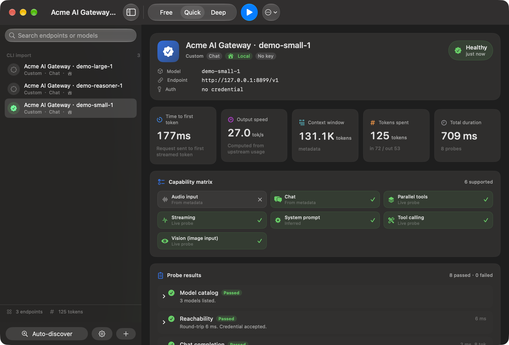
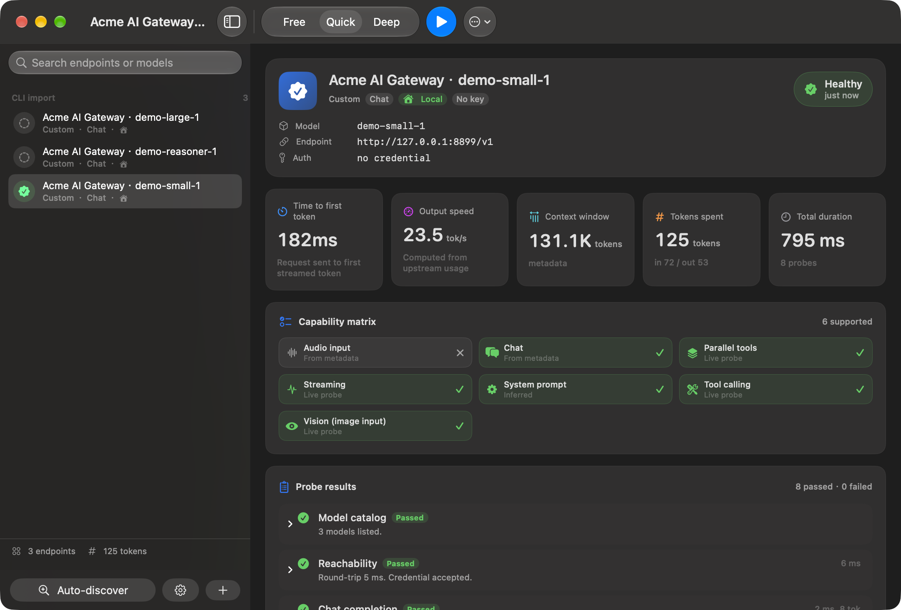
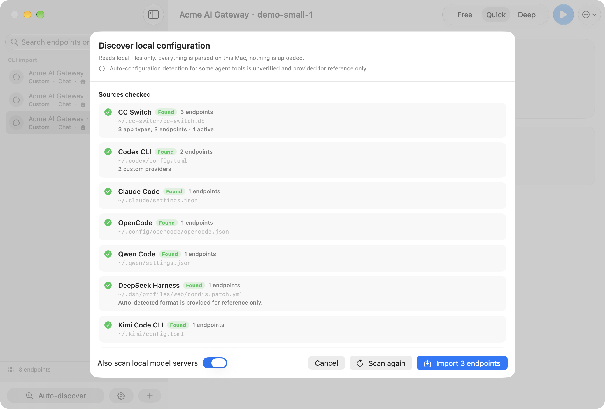
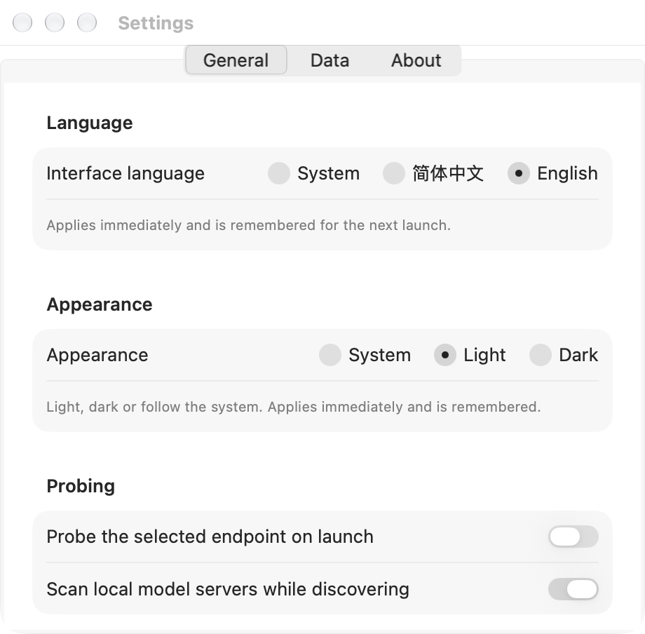

<p align="center">
  
</p>

<h1 align="center">LLMProbe</h1>

<p align="center">
  <b>A local health check for LLM upstreams</b><br>
  One click or one command answers four questions: is the upstream alive? how fast is it?<br>
  how big is its context? and which capabilities does it really have?<br>
  Native macOS GUI (SwiftUI) + full CLI · bilingual · local configuration parsing · MIT
</p>

<p align="center">
  <a href="README.md"></a>
  <a href="README.en.md"></a>
</p>

<p align="center">
  <a href="https://github.com/Lucas-Qh-Lai/llm-probe/actions/workflows/ci.yml"></a>
  
  
  
  
</p>

> Chinese version: [README.md](README.md)

> **Privacy promise: apart from probe requests that you explicitly send to a selected LLM upstream, LLMProbe runs entirely on this Mac.**
> It never uploads agent configuration, endpoints, model names, credentials or usage data. There is no telemetry, crash reporting, update check or phoning home.
> The project is MIT-licensed and fully source-available for review, reproduction and independent builds.
>
> **Human + AI Vibe Coding.** This project is human-AI vibe coding, end to end; see [Vibe Coding and Acknowledgements](#vibe-coding-and-acknowledgements) for its origin, credits and disclaimer.

---

## What this is

If you switch LLM upstreams with CC Switch / Codex CLI / Claude Code / OpenCode, you have probably hit at least one of these:

- You edited the config and switched the proxy, but you do not actually know whether it **works**;
- A proxy advertises "tool calling / 1M context / vision" and **falls over the first time you use it**;
- Throughput feels random, and you cannot tell whether it is the upstream or your local network;
- You want the **real max output tokens** of a model without burning production traffic to find out.

LLMProbe exists for exactly that: it reads the agent configuration already on your Mac (**read-only**), lists the endpoints, and fires the **smallest possible requests** to report health, speed, context size and a capability matrix.

It has two dependencies: your Mac, and the upstream you want to test. No account, no cloud, no telemetry.

---

## Screenshots

> Every screenshot is produced from fictional demo data inside this repository (`scripts/demo_server.py` + `scripts/capture_screenshots.sh`). No real configuration appears in them.
> This file shows the English interface only; the Chinese screenshots live in [README.md](README.md).

### Home screen (light)

<picture>
  <source media="(prefers-color-scheme: dark)" srcset="docs/images/screenshot-main-dark-en.png">
  
</picture>

### Dark mode

Settings → Appearance switches between **System / Light / Dark**; the change applies immediately and is remembered. GitHub switches images on the viewer's theme, so the home-screen capture above turns dark on its own when this page is read in a dark theme.



### Discovering local configuration



### Settings: language, appearance, data and privacy



---

## Features

| Area | What it does |
| --- | --- |
| **Health** | DNS / TLS / port / credential acceptance / model id resolution, each with a verdict and an actionable hint |
| **Speed** | Streaming request measures **TTFT** and **output tokens/second**, with repeatable sampling (median) and a trend chart in the GUI |
| **Context window** | Reads catalog metadata first (**0 tokens**); can measure the real limit with an opt-in payload search |
| **Max output tokens** | Uses the declared value, otherwise extracts the true limit from a deliberately-too-large request (**0 completion tokens**) |
| **Capability matrix** | Tool calling, parallel tools, vision, audio in/out, structured output, JSON mode, reasoning, prompt caching, system prompt, seeds, logprobs, embeddings, streaming |
| **Config discovery** | CC Switch, Codex CLI, Claude Code, OpenCode, Gemini CLI, Continue, Aider, environment variables, local model servers — merged and de-duplicated |
| **Bilingual** | GUI fully bilingual, switchable in Settings with no restart; defaults to the system language (Chinese Mac → Chinese, English Mac → English, anything else → English) |
| **GUI + CLI** | One engine. SwiftUI app (native controls, menus, Settings window) plus a scriptable CLI |
| **Local only** | No telemetry, no uploads, no cloud validation; state file `0600`; every outbound string is redacted |
| **Many vendors** | 28 vendor presets and 5 protocol adapters; any OpenAI-compatible endpoint works manually |
| **Token discipline** | Three plans, the cheapest one spends **0 completion tokens**; capability findings are cached so repeat runs are free |

---

## Installation

### Option 1: download the app (recommended)

Releases include two native macOS builds. Choose the one matching your processor:

| Mac type | Download | Notes |
| --- | --- | --- |
| **Apple silicon (ARM64)** | `LLMProbe-<version>-macOS-ARM64.zip` | M1, M2, M3, M4 and newer Apple silicon Macs |
| **Intel (x86_64)** | `LLMProbe-<version>-macOS-Intel-x86_64.zip` | Macs with an Intel Core processor |

If unsure, open **Apple menu → About This Mac**. An M-series chip means the Apple silicon build; an Intel Core processor means the Intel build. Both are native builds for their target architecture and do not rely on Rosetta translation.

1. Download the matching zip from [Releases](https://github.com/Lucas-Qh-Lai/llm-probe/releases);
2. Unzip and drag `LLMProbe.app` into Applications;
3. If Gatekeeper complains (builds are ad-hoc signed, not notarised), right-click the icon → **Open** → **Open** again.

Each zip includes a `.sha256` file, plus a combined `LLMProbe-<version>-SHA256SUMS` for verification.

### Option 2: build from source

Requires **macOS 14+** and the Xcode **Command Line Tools** (full Xcode is *not* required):

```bash
xcode-select --install            # if the tools are missing
git clone https://github.com/Lucas-Qh-Lai/llm-probe.git
cd llm-probe

./scripts/build_app.sh release    # builds the current architecture and installs ~/Applications/LLMProbe.app
./scripts/build_app.sh release ~/Applications x86_64   # cross-build Intel (x86_64) when needed
./scripts/install_cli.sh          # installs the CLI into /usr/local/bin (falls back to ~/.local/bin)
```

### Agent installation instructions

Hand this block to your agent (Claude Code / Codex / Cursor — anything that can run shell commands):

```bash
set -euo pipefail
# 1. Dependency check: tell the user instead of failing silently
xcode-select -p >/dev/null || { echo "run: xcode-select --install"; exit 1; }
# 2. Fetch and build
WORK="${TMPDIR:-/tmp}/llm-probe-build"
[ -d "$WORK/.git" ] || git clone --depth 1 https://github.com/Lucas-Qh-Lai/llm-probe.git "$WORK"
cd "$WORK"
# 3. The offline self test must be green before anything else
swift build -c release
./.build/release/llmprobe selftest
# 4. Install GUI + CLI
./scripts/build_app.sh release
./scripts/install_cli.sh
# 5. Smoke test: the free plan spends zero completion tokens
llmprobe probe --url http://127.0.0.1:11434/v1 --model llama3.1 --plan free --json
```

Notes for agents:

- `llmprobe probe ... --json` is **non-interactive and never asks a question**; the exit code is the verdict;
- `--plan free` spends **zero completion tokens**, safe for cron and CI;
- Inside JSON, `kind` / `status` / `verdict` and capability keys are **always English**, regardless of interface language;
- All output is redacted: credentials are reported as "configured / not configured", never printed.

---

## Quick start (GUI)

1. Open LLMProbe and click **Auto-discover config**;
2. The sheet lists the sources and endpoints it read (CC Switch providers, Codex providers, Claude Code environment overrides…); press **Scan again** to re-read them;
3. Click the blue **Import N endpoints** button — only then do they appear in the sidebar. **Cancel** adds nothing;
4. Select one, pick a plan (Free / Quick / Deep) and hit **⌘↩**;
5. The detail pane shows four metric cards (verdict / TTFT / output speed / context), the capability matrix and every probe result.

Shortcuts: `⌘N` add endpoint · `⇧⌘D` discover · `⌘↩` probe selected · `⇧⌘R` probe all · `⌘.` cancel · `⌘,` Settings.

Settings lets you switch the **interface language (System / Simplified Chinese / English)**; the change applies immediately and is remembered.

---

## CLI

The CLI shares the whole engine with the app, so behaviour is identical.

```text
llmprobe discover [--json] [--no-local] [--no-env]
llmprobe import [--no-local] [--no-env]
llmprobe probe --index <n> [--plan free|quick|deep] [--json] [--context-search]
llmprobe probe --all [--plan quick] [--json]
llmprobe probe --url <base-url> --model <model> [options]
llmprobe list-sources
llmprobe selftest [--json]
llmprobe version
llmprobe help
```

### Examples

```bash
# 1. Which local configs can be read? (read-only, writes nothing)
llmprobe list-sources

# 2. Probe the discovered endpoints to get their index numbers
llmprobe discover

# 3. Zero-completion-token health check (good for cron / CI)
llmprobe probe --index 3 --plan free

# 4. A hand-written endpoint, quick plan, remembered in the state file
llmprobe probe --url https://api.example.com/v1 --model my-model \
  --plan quick --key-env MY_API_KEY --save

# 5. Health-check everything CC Switch / Codex knows about, as JSON
llmprobe discover --json > /tmp/sources.json
llmprobe probe --all --plan quick --json > /tmp/report.json

# 6. Measure the real context limit (spends input tokens)
llmprobe probe --index 3 --plan deep --context-search
```

### Options

| Flag | Meaning |
| --- | --- |
| `--url <url>` | Base URL, e.g. `https://api.openai.com/v1` |
| `--model <model>` | Model id |
| `--wire <api>` | `openai-chat` / `openai-responses` / `anthropic-messages` / `google-gemini` / `ollama` |
| `--key <secret>` | Inline credential (prefer `--key-env`; inline secrets leak into shell history) |
| `--key-env <NAME>` | Read the credential from an environment variable |
| `--plan <name>` | `free` / `quick` (default) / `deep` |
| `--samples <n>` | Streaming samples for the speed median |
| `--context-search` | Measure the context window with a real payload (spends input tokens) |
| `--timeout <seconds>` | Per-request timeout, default 45 |
| `--json` | Machine-readable output (English keys, one document) |
| `--save` | Remember the endpoint in `~/Library/Application Support/LLMProbe` |
| ~~`--language`~~ | The CLI prints **English only**, so script and agent output stays stable; use the GUI for the Chinese interface |

### Human-readable output

```text
$ llmprobe probe --url http://127.0.0.1:8899/v1 --model demo-small-1 --plan quick

Acme AI Gateway · demo-small-1
  OpenAI Chat Completions · http://127.0.0.1:8899/v1 · demo-small-1

  PASS  Model catalog        3 models listed.
  PASS  Reachability         Round-trip 8 ms. Credential accepted.
  PASS  Chat completion      Completion returned in 2 ms.
  PASS  Streaming speed      TTFT 182 ms · 22.7 tok/s
  PASS  Tool calling         2 tool call(s), arguments valid.
  PASS  Vision input         Image accepted and identified correctly.
  PASS  Max output tokens    16.4K tokens, from catalog metadata.
  PASS  Context window       131.1K tokens, from catalog metadata.

  Verdict: healthy · 820 ms · 125 tokens · TTFT 182 ms · 22.7 tok/s
  Supported: Chat, Streaming, Tool calling, Parallel tools, Vision (image input), System prompt
  Not supported: Audio input
```

### JSON output

Keys and enum values are **always English**, independent of the interface language:

```json
{
  "verdict": "healthy",
  "endpoint": {
    "name": "Acme AI Gateway · demo-small-1",
    "provider": "custom",
    "wire_api": "openai-chat",
    "base_url": "http://127.0.0.1:8899/v1",
    "model": "demo-small-1",
    "auth": "no credential",
    "local": true
  },
  "tokens": { "input": 0, "output": 0, "total": 0 },
  "capabilities": {
    "chat": "supported",
    "streaming": "supported",
    "tools": "supported",
    "vision": "supported",
    "audio-input": "unsupported"
  },
  "outcomes": [
    { "kind": "connectivity", "status": "passed", "summary": "Round-trip 8 ms. Credential accepted.", "duration_ms": 8.4 },
    { "kind": "context-window", "status": "passed", "summary": "131.1K tokens, from catalog metadata." }
  ]
}
```

`probe --all --json` emits a **single** document so you can pipe it straight into `jq`:

```json
{ "verdict": "degraded", "count": 3, "reports": [ { "...": "..." } ] }
```

### Exit codes

| Code | Meaning |
| --- | --- |
| `0` | Healthy |
| `1` | Degraded or unhealthy (or the self test failed) |
| `2` | Usage error, unknown endpoint, unreadable configuration |

A batch run returns the **worst** verdict, which makes it directly usable in CI:

```bash
if ! llmprobe probe --all --plan free --json > report.json; then
  echo "at least one upstream is unhealthy" >&2
fi
```

---

## Supported vendors and protocols

### Protocol adapters (how a request is sent)

| `--wire` | Wire shape it covers |
| --- | --- |
| `openai-chat` | `/chat/completions`: OpenAI and most compatible proxies (OpenRouter, DeepSeek, Groq, vLLM, Ollama, LM Studio…) |
| `openai-responses` | `/responses`: the newer OpenAI Responses API, including reasoning fields |
| `anthropic-messages` | `/v1/messages`: Anthropic and every Claude-compatible proxy |
| `google-gemini` | `generateContent`: Google Gemini / Vertex style |
| `ollama` | Ollama's native chat API |

The wire API is inferred automatically (hostname, configuration shape, model id convention) and can always be forced with `--wire`.

### Vendor presets (28)

OpenAI · Anthropic · Google Gemini · Azure OpenAI · OpenRouter · DeepSeek · Moonshot / Kimi · Zhipu GLM · Alibaba DashScope · MiniMax · Xiaomi MiMo · iFlow · SiliconFlow · Groq · Mistral · xAI · Together AI · Fireworks AI · Perplexity · Cerebras · Ollama · LM Studio · MLX server · vLLM · LiteLLM · One API / New API · Command Code · Custom

A preset only fills in the default base URL and the common environment variable names (`OPENAI_API_KEY`, `ANTHROPIC_API_KEY`, `GEMINI_API_KEY`…). **Any** OpenAI-compatible endpoint can be entered as Custom.

---

## Probes and the three plans

### The 11 probes

| Probe | What it does | Completion tokens |
| --- | --- | --- |
| Reachability | DNS / TLS / port / credential acceptance | 0 |
| Model catalog | Reads the catalog, confirms the model id, harvests context and output metadata | 0 |
| Chat completion | One tiny non-streaming request proving generation works | ~16 |
| Streaming speed | Streams, measures TTFT and tok/s | ~48 |
| Tool calling | Forces one tool call and validates the returned JSON | ~64 |
| Vision input | Sends a tiny PNG | ~8 |
| Structured output | Requests JSON constrained by a schema | ~48 |
| Context window | Metadata → zero-output validation → optional payload search | 0 (search spends input) |
| Max output tokens | Reads the declaration or extracts the real limit from an overflow error | 0 |
| Reasoning | Checks whether reasoning/thinking fields are accepted and returned | ~64 |
| Embeddings | Calls the embeddings route | 0 |

### The three plans

| Plan | Probes | Token budget | Use it for |
| --- | --- | --- | --- |
| `free` | Reachability, catalog, context, max output | 2,000 | Cron, CI, agent self-checks — **0 completion tokens** |
| `quick` (default) | free + chat, streaming, tools, vision | 5,000 | "Is this endpoint actually usable today?" |
| `deep` | All 11 + 3 speed samples + payload context search | 60,000 | Vetting a new proxy; catching advertised-but-fake capabilities |

### How it saves tokens without losing accuracy

1. **Metadata before requests** — context window and max output come from the catalog when possible;
2. **Errors as evidence** — max output is often revealed by a request that *must* fail (`max_tokens is too large: 999999. This model supports at most 8192` → the answer is 8192, not the rejected 999999);
3. **Cached capability findings** — evidence collected once is reused, so repeat tests cost nothing;
4. **Probes stop when the answer is settled** — a capability explicitly rejected with a 400 is not re-attempted;
5. **One sample by default** — only `deep` repeats the speed probe for a median.

---

## Automatic discovery: what it reads

Every reader is **read-only**: LLMProbe never edits, migrates or “repairs” another tool's configuration.

| Agent tool | Primary path | What it reads |
| --- | --- | --- |
| CC Switch | `~/.cc-switch/cc-switch.db` | Providers, wire protocols, models and active rows via read-only SQLite |
| Codex CLI | `~/.codex/config.toml` (respects `CODEX_HOME`) | Custom providers, `base_url`, wire API, models and `env_key` |
| Claude Code | `~/.claude/settings.json` | `ANTHROPIC_BASE_URL`, credential sources and model |
| OpenCode | `~/.config/opencode/opencode.json` | Providers, `options.baseURL`, model tables and local auth sources |
| Gemini CLI | `~/.gemini/settings.json` | Custom endpoints, models and `.env` |
| GitHub Copilot CLI | `~/.copilot/config.json` + `COPILOT_PROVIDER_*` | BYOK base URL, protocol, model and credential source |
| Cursor CLI | `~/.cursor` | Installation status only; the hosted route has no stable public local base URL |
| Amazon Q Developer CLI | `~/.aws/amazonq` | Installation status only; no guessed Amazon Bedrock endpoint |
| Qwen Code | `~/.qwen/settings.json` | `modelProviders`, `baseUrl`, `envKey` and models |
| DeepSeek Harness | `$DSH_HOME/profiles/*/cordis.patch.yml` | Provider routes, protocols, models and `apiKeyEnv` |
| Kimi Code CLI | `~/.kimi/config.toml` | `providers`, `models`, `base_url` and `api_key` source |
| MiniMax Code | Common `~/.config/minimax-code` paths | Providers, API formats and models (automatic paths not fully verified) |
| ZCode | Common `~/.zcode` / Application Support paths | Providers, OpenAI / Anthropic base URLs and models (automatic paths not fully verified) |
| MiMo Code | `~/.config/mimocode/mimocode.jsonc` | `provider`, `baseURL`, `apiKey` and model mapping |
| iFlow CLI | `~/.iflow/settings.json` | `baseUrl`, `modelName` and `apiKey` source |
| Trae Agent | Common `trae_config.yaml` paths | `model_providers`, `models` and `base_url` (automatic paths not fully verified) |
| Pi | `~/.pi/agent/models.json` | `providers`, `baseUrl`, `api` and `models` |
| OpenClaw | `~/.openclaw/openclaw.json` and agent `models.json` | `models.providers`, protocols, model capabilities and context metadata |
| Hermes Agent | `~/.hermes/config.yaml` | `model`, `providers` / `custom_providers`, `base_url` and `api_mode` |
| Continue | `~/.continue/config.json` | Providers and `apiBase` |
| aider | `~/.aider.conf.yml` | OpenAI-compatible base URL and model |
| Environment | Current process environment | Common `*_API_KEY` / `*_BASE_URL` / `*_MODEL` variables |
| Local services | `127.0.0.1` | Common local model-server ports |

> **Detection disclaimer: automatic configuration detection for some agent tools is unverified and provided for reference only.**
> Paths or versioned schemas may change, especially for `MiniMax Code`, `ZCode` and `Trae Agent`. Review imported endpoints before probing. Hosted routes that cannot be mapped reliably are marked skipped instead of guessing a base URL.

### About CC Switch

CC Switch is the **first** source this tool reads, because on most Macs it is the single source of truth for "which upstream am I actually using right now". A few deliberate constraints:

- The database is **always opened `?mode=ro`** and only ever queried with `SELECT`; LLMProbe never writes, migrates or mutates CC Switch data;
- `settings_config` JSON is parsed per `app_type`, because each app stores a different shape (Codex keeps a whole `config.toml`, Claude keeps an `env` block, OpenCode keeps `options.baseURL`, hermes is flat);
- Rows with `is_current` are tagged `active`, so the list shows which one is live;
- Credentials are recorded as a **source** (env var name / configured value) and always go through `Redactor`; only "configured" is ever displayed.

> Every name in the screenshots (`Acme AI Gateway`, `demo-small-1`, `127.0.0.1:8899`) comes from the fictional demo server in this repository.

---

## Privacy and security

> **Promise in one sentence: apart from active probe requests sent to the upstream you choose, LLMProbe runs locally and never uploads configuration.**

- **No configuration upload** — agent configs, endpoints, model names, credential sources and reports stay in local memory/state;
- **No telemetry** — no analytics, crash reporting, update checks or other phone-home calls;
- **Third-party configs are read-only** — CC Switch SQLite is always opened with `?mode=ro`;
- **Redacted exits** — terminal output, exported reports and JSON pass through `Redactor`;
- **State file `0600`** — `~/Library/Application Support/LLMProbe/state.json` is readable only by the current user;
- **Open source for audit** — source, build scripts, privacy scanner and screenshot pipeline are all available under MIT;
- **The one exception** — running a probe sends its test prompt and required request body to the upstream you explicitly select; configuration itself is not uploaded to LLMProbe or any third-party service.

Verify runtime network connections yourself:

```bash
sudo lsof -i -n -P | grep LLMProbe
```

---

## Cross-platform status

| Platform | Status |
| --- | --- |
| **macOS 14+ (Apple Silicon / Intel)** | Built, run and screenshot-verified on the developer's machine |
| **Windows** | Written to be portable, but **the developer has no Windows machine to test on — it has never been tested and is not guaranteed to work** |
| **Linux** | `LLMProbeCore` and the `llmprobe` CLI only depend on Foundation and should compile; the GUI is SwiftUI/AppKit and **does not work on Linux**. **No Linux test machine was available: never actually tested** |

> Short version: **anything other than macOS is best-effort and unverified.** CI does one build smoke test on Linux (compiles = pass), which is not a functional guarantee. Please report real results in an issue.

---

## Development

```bash
swift build                              # everything
swift build --product llmprobe           # CLI only (fast)
swift run llmprobe selftest              # offline self test — must stay 42/42 green
swift test                               # needs full Xcode; use selftest without it
./scripts/build_app.sh release           # build + install ~/Applications/LLMProbe.app
./scripts/install_cli.sh                 # install the CLI
./scripts/check_privacy.sh               # privacy gate before committing
./scripts/capture_screenshots.sh         # regenerate docs screenshots from demo data (needs an unlocked screen)
```

### Contributing and updates

Bug fixes, agent configuration adapters, UI/copy improvements, tests, documentation and real platform reports are all welcome. Open an Issue first to describe the problem or proposal; larger refactors, compatibility breaks and release-process changes should be agreed before implementation.

#### Recommended workflow

1. **Pick a concrete task** — claim an existing Issue or open one with reproduction steps and expected behavior. Report security issues through GitHub Private Vulnerability Reporting, not a public Issue.
2. **Fork and branch** — use `fix/...`, `feature/...`, `discovery/...` or `docs/...`; do not push directly to protected branches.
3. **Build and self-test locally** — run at least `swift build` and `swift run llmprobe selftest`. The current baseline is **42/42 green**; every new pure parsing/classification rule needs a `SelfTest.Check`.
4. **Run the privacy gate** — `./scripts/check_privacy.sh` must be clean. Never commit real base URLs, model names, credentials, cookies, `state.json`, `.app` bundles or machine-specific absolute paths.
5. **Open a Pull Request** — explain what changed, why, how it was tested and which platforms are affected. UI changes need before/after screenshots; discovery changes need fictional fixture results. PRs are checked for build, self-test, privacy, copy and regressions.
6. **Merge and release** — maintainers review, merge, update version/docs/release notes. Releases are cumulative; old tags and releases are never deleted.

#### Especially welcome contributions

- New read-only agent-harness readers using the `ConfigReader` / `AgentConfigExtractor` shape;
- Real Windows/Linux hardware results, not compile-only claims;
- Product-name capitalization, terminology, bilingual copy and README corrections;
- SwiftUI/AppKit-native UI improvements, accessibility, keyboard support and Reduce Motion;
- Offline parser fixtures, protocol-adapter tests and privacy regressions.

#### Adapter contribution rules

- Consult official documentation and record paths, field names and official product spelling;
- Do not execute the discovered tool, write its config directory or print plaintext secrets;
- Return `notFound` / `unsupported` when parsing fails; never guess a base URL;
- Mark unverified paths or schemas as “unverified and provided for reference only”;
- Add `SelfTest` coverage for new pure functions and use only `Acme` / `demo-*` data in screenshots.

### Layout

```text
Sources/
  LLMProbeCore/          engine, Foundation only, portable
    Model/               endpoint, wire API, capabilities, plans, results
    Net/                 HTTP client, SSE decoder, error classifier
    Providers/           5 protocol adapters + vendor registry + endpoint inference
    Probes/              the 11 probes and their prompts
    Discovery/           23 discovery sources (including CC Switch's read-only SQLite)
    Support/             redaction, token estimation, cache, state store, i18n, self test
  llmprobe/              CLI (discover / probe / import / list-sources / selftest)
  LLMProbeApp/           SwiftUI app (sidebar, detail, editor, discovery sheet, settings)
Tests/                   XCTest wrapper around the engine self test (needs full Xcode)
scripts/                 build, install, screenshots, privacy scan, demo server
docs/images/             screenshots and app icon
```

### What the offline self test covers

`llmprobe selftest` touches no network and no credential. Its 42 checks cover redaction, token estimation, JSONC / TOML / YAML-subset parsing (including indentless sequences), multi-agent provider/model extraction, product-name capitalization, SSE framing, endpoint de-duplication and local-host detection, wire-API inference, error classification (including limit extraction), plan budgets, capability cache precedence, state round-trip, modality coverage, bilingual/enumeration coverage, launch arguments, transport-message localization, system-language mapping, appearance-preference parsing (`--appearance`) and the English-only CLI contract.

---

## FAQ

**Why is the app ad-hoc signed and blocked on first launch?**
There is no Apple Developer account behind this project; the signature only protects the local bundle. Right-click → Open once and macOS remembers. Or build it yourself (Option 2).

**Does it read my keys? Does it write anywhere?**
It reads them (it cannot test your endpoint otherwise), but only keeps the *source* and redacts every exit path. It never writes back into another tool's config directory, and owns exactly one state file with `0600` permissions.

**How can the free plan know the context window?**
Because most endpoints declare `context_window` in their model catalog. When it cannot, the result says so explicitly ("from catalog metadata" / "needs a payload search") instead of inventing a number.

**The probe result disagrees with real usage.**
That is normal: proxies often rewrite the protocol layer (for example swallowing `tools` while still returning 200). LLMProbe judges the **response body**, not just the status code, so its supported/unsupported answers are closer to reality than a ping.

**Can I use it for load testing?**
Please don't — it is a health check, not a benchmark. Each probe fires once (`deep` fires three times for the speed median).

---

## Project and Support

- Repository: <https://github.com/Lucas-Qh-Lai/llm-probe>
- Author: **Lucas-Qh-Lai**
- The same links live in the app under **Settings → About**, next to the version number.

If LLMProbe helped you, you are welcome to buy me a coffee ☕️ — [GitHub Sponsors](https://github.com/sponsors/Lucas-Qh-Lai).
No pressure at all: filing an issue, reporting a bug or starring the repo counts as support too.

---

## Vibe Coding and Acknowledgements

LLMProbe is the result of a human and AI **vibe coding** together: the requirements, the judgement calls and the final decisions are human, while a substantial part of the code, documentation and tests was produced with AI assistance. We state this plainly instead of hiding it — it is how the project actually came to be.

The harness used for this project is **OpenAI Codex**; the primary model is **DeepSeek V4.1 Flash**, with additional work done by **MiMo V2.6 Pro** and **Muse Spark 1.3**.

Thanks to that tool and those models for their help throughout development: from protocol adapters, discovery parsing, probe design and self-test coverage to the repeated polish of the bilingual docs. Thanks also to the upstream vendors, protocol specifications and local agent tools whose public documentation made a fully local, auditable health checker possible.

### Disclaimer

- This project is produced jointly by a human and AI and comes with **no guarantee** that the code, docs or probe results are fully correct in every environment. AI involvement means omissions, stale information and wrong judgement calls are possible; review it yourself and double-check any critical conclusion before relying on it.
- LLMProbe only parses local configuration read-only, and only sends probe requests to the upstreams **you explicitly select**. It does not endorse, warrant or recommend any third-party service, vendor or model.
- Probe results describe the upstream as it behaved **at the moment of the test** and may disagree with real usage because of rewriting, rate limiting, routing or configuration differences. Your own production verification is the source of truth.
- The project is provided "as is" under the MIT license, and the author is not liable for any direct or indirect damages arising from its use. Assess and accept the risk yourself, and do not probe third-party endpoints without authorisation.

---

## License

[MIT](LICENSE). Use it however you like, including commercially; just don't blame me when something breaks.
