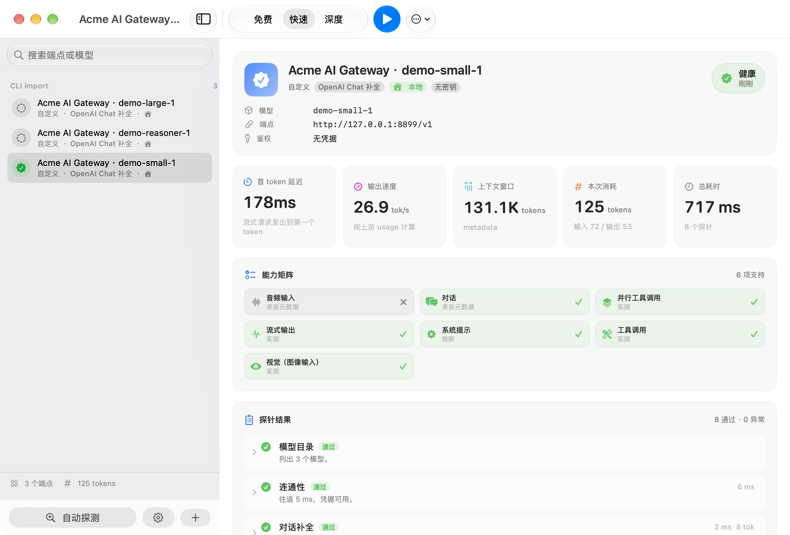
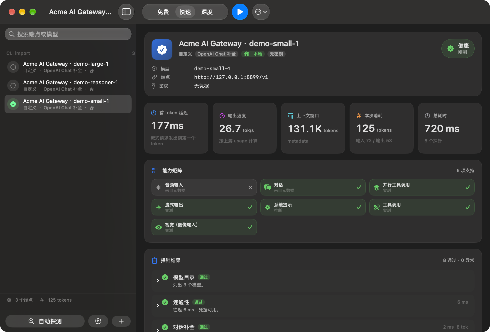
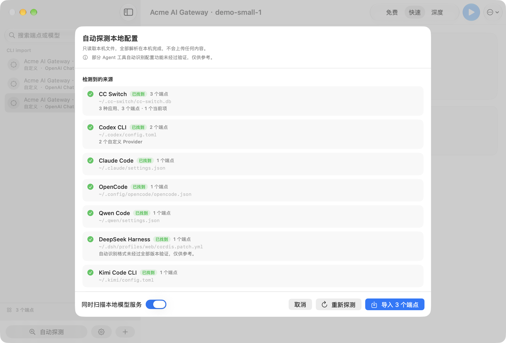
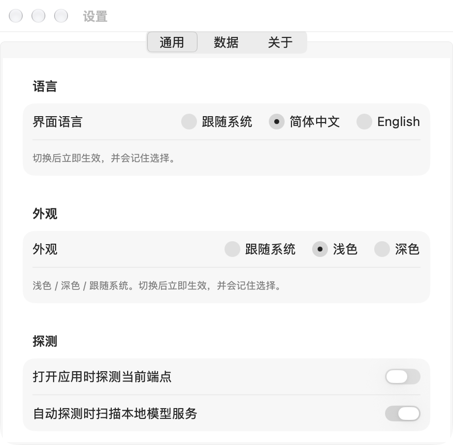

<p align="center">
  
</p>

<h1 align="center">LLMProbe</h1>

<p align="center">
  <b>本地运行的 LLM 上游体检工具</b><br>
  一条命令 / 一次点击，回答四个问题：上游活着吗？多快？上下文多大？到底支持哪些能力？<br>
  macOS 原生 GUI（SwiftUI）+ 完整 CLI · 中英双语 · 配置解析完全本地 · MIT 开源
</p>

<p align="center">
  <a href="README.md"></a>
  <a href="README.en.md"></a>
</p>

<p align="center">
  <a href="https://github.com/Lucas-Qh-Lai/llm-probe/actions/workflows/ci.yml"></a>
  
  
  
  
</p>

> English version: [README.en.md](README.en.md)

> **隐私承诺：除你主动运行探针时发往所选 LLM 上游的测试请求外，LLMProbe 完全在本机运行。**
> 它不会上传任何 Agent 配置、端点、模型名、密钥或使用数据；没有遥测、崩溃上报、更新检查或“电话回家”。
> 项目以 MIT 开源，完整源码可供审查、复现和独立构建。

---

## 这是什么

你在用 CC Switch / Codex CLI / Claude Code / OpenCode 之类的工具切换上游时，大概遇到过这些情况：

- 换了中转站，配置文件改完了，但不确定**到底通不通**；
- 代理声称「支持工具调用 / 1M 上下文 / 视觉」，**实际一用就报错**；
- 速度忽快忽慢，说不清是上游问题还是本地网络问题；
- 想知道某模型的**真实最大输出 token**，但不想拿正式业务去试错。

LLMProbe 就是给这些问题准备的：它读取你本机已有的 Agent 配置（**只读**），把端点列出来，然后用**尽可能少的 token**发几次最小请求，给出健康状态、速度、上下文长度和能力矩阵。

它只有两个依赖：你的 Mac，和你自己想测的上游。没有账号、没有云服务、没有遥测。

---

## 界面截图

> 所有截图都来自仓库内的虚构演示数据（`scripts/demo_server.py` + `scripts/capture_screenshots.sh`），不含任何真实配置。
> 本文件只放中文界面截图；英文界面截图见 [README.en.md](README.en.md)。

### 主界面（浅色）

<picture>
  <source media="(prefers-color-scheme: dark)" srcset="docs/images/screenshot-main-dark.png">
  
</picture>

### 深色模式

设置 → 外观可在 **跟随系统 / 浅色 / 深色** 之间切换，立即生效并记住选择。GitHub 支持按浏览器主题切换图片，所以在深色主题下浏览本页时，上面的主界面截图会自动换成深色版本。



### 自动探测本机配置



### 设置：语言、外观、数据与隐私



---

## 核心特性

| 能力 | 说明 |
| --- | --- |
| **健康检测** | DNS / TLS / 端口 / 凭据是否被接受 / 模型 ID 是否存在，逐项给出结论和可执行的修复建议 |
| **速度测量** | 流式请求测 **TTFT（首 token 延迟）** 与 **输出速度（tok/s）**，可重复采样取中位数，并在 GUI 里画趋势图 |
| **上下文长度** | 优先读模型目录元数据（**0 token**）；需要实证时用 payload 搜索实测上限 |
| **最大输出 token** | 优先读声明值；没有声明时用一次「故意超限」的请求，从上游报错里读出真实上限（**0 completion token**） |
| **能力矩阵** | 工具调用、并行工具调用、视觉、音频输入/输出、结构化输出、JSON 模式、推理模式、提示缓存、系统提示、种子、logprobs、嵌入、流式 |
| **自动探测配置** | CC Switch、Codex、Claude Code、OpenCode、Gemini CLI、Continue、Aider、环境变量、本机模型服务（23 个来源），合并去重、确认后一键导入 |
| **中英双语** | GUI 全量双语，设置里随时切换、无需重启；默认跟随系统语言（中文系统→中文，英文系统→英文，其它语言→英文） |
| **GUI + CLI** | 同一套引擎。GUI 用 SwiftUI（原生控件、原生菜单、原生设置窗口），CLI 供终端与你自己的 Agent 调用 |
| **完全本地** | 不发送遥测、不上传配置、不做任何「云端校验」；状态文件权限 `0600`；输出经过统一脱敏 |
| **多厂商** | 28 种厂商预设 + 5 种协议适配器，任何 OpenAI 兼容端点都能手填 |
| **测试省 token** | 三档计划，最低一档 **0 completion token**；能力结论带缓存，重复测试不重复花钱 |

---

## 安装

### 方式一：下载现成的 App（推荐）

Release 同时提供两个 macOS 原生版本，请按电脑处理器选择：

| 电脑类型 | 应下载的文件 | 说明 |
| --- | --- | --- |
| **Apple 芯片（ARM64）** | `LLMProbe-<版本>-macOS-ARM64.zip` | 适用于 M1 / M2 / M3 / M4 及更新的 Apple 芯片 Mac |
| **Intel（x86_64）** | `LLMProbe-<版本>-macOS-Intel-x86_64.zip` | 适用于搭载 Intel Core 处理器的 Mac |

不确定型号时，打开 **苹果菜单 → 关于本机**：显示 M 系列芯片就是 Apple 芯片版；显示 Intel Core 就下载 Intel 版。两个包都是对应架构的原生二进制，不需要靠 Rosetta 翻译。

1. 到 [Releases](https://github.com/Lucas-Qh-Lai/llm-probe/releases) 下载对应架构的 zip；
2. 解压后把 `LLMProbe.app` 拖进「应用程序」；
3. 首次打开如果被 Gatekeeper 拦下（应用是 ad-hoc 签名，没有 Apple 开发者签名），右键点图标 → **打开** → 再点「打开」即可。

Release 同时附每个 zip 的 `.sha256` 与汇总的 `LLMProbe-<版本>-SHA256SUMS`，下载后可自行校验。

### 方式二：从源码构建

需要 **macOS 14+**，以及 Xcode **Command Line Tools**（不需要完整 Xcode）：

```bash
xcode-select --install            # 如果还没装命令行工具
git clone https://github.com/Lucas-Qh-Lai/llm-probe.git
cd llm-probe

./scripts/build_app.sh release    # 构建当前架构并安装到 ~/Applications/LLMProbe.app
./scripts/build_app.sh release ~/Applications x86_64   # 需要时交叉构建 Intel（x86_64）版
./scripts/install_cli.sh          # 安装 CLI 到 /usr/local/bin（无权限时自动用 ~/.local/bin）
```

### 给 Agent 的安装指令

把下面这段直接交给你的 Agent（Claude Code / Codex / Cursor 等都可以）：

```bash
set -euo pipefail
# 1. 依赖检查（缺 CLI tools 时提示用户手动安装，不要静默失败）
xcode-select -p >/dev/null || { echo "需要先运行: xcode-select --install"; exit 1; }
# 2. 取源码并构建
WORK="${TMPDIR:-/tmp}/llm-probe-build"
[ -d "$WORK/.git" ] || git clone --depth 1 https://github.com/Lucas-Qh-Lai/llm-probe.git "$WORK"
cd "$WORK"
# 3. 离线自检必须全绿，否则不要继续
swift build -c release
./.build/release/llmprobe selftest
# 4. 安装 GUI + CLI
./scripts/build_app.sh release
./scripts/install_cli.sh
# 5. 冒烟测试：零 completion token 的免费档
llmprobe probe --url http://127.0.0.1:11434/v1 --model llama3.1 --plan free --json
```

Agent 使用要点：

- `llmprobe probe ... --json` **不需要交互、不会提问**，退出码即结论；
- `--plan free` **不消耗 completion token**，可以放心在自动化里定期跑；
- JSON 里的 `kind` / `status` / `verdict` / 能力键名**永远是英文**，不受界面语言影响，便于脚本匹配；
- 所有输出都经过脱敏，不会打印密钥原文（只打印「已配置 / 未配置」）。

---

## 快速上手（GUI）

1. 打开 LLMProbe，点 **自动探测配置**；
2. 面板里会列出读到的来源和端点（CC Switch 里的 provider、Codex 配置里的模型、Claude Code 的环境变量等）；想重扫就点 **重新探测**；
3. 点蓝色的 **导入 N 个端点**，端点才进入左侧列表；点 **取消** 则不会添加任何配置；
4. 选中端点，选好强度（免费 / 快速 / 深度），按 **⌘↩** 开始探测；
5. 右侧看四张指标卡（结论 / TTFT / 输出速度 / 上下文）、能力矩阵和每个探针的明细。

快捷键：`⌘N` 添加端点 · `⇧⌘D` 自动探测 · `⌘↩` 测当前端点 · `⇧⌘R` 测全部 · `⌘.` 取消 · `⌘,` 设置。

设置窗口里可以切换 **界面语言（跟随系统 / 简体中文 / English）**，改动立即生效并记住。

---

## CLI 用法

CLI 与 GUI 共用同一个引擎，行为完全一致。

```text
llmprobe discover [--json] [--no-local] [--no-env]
llmprobe import [--no-local] [--no-env]
llmprobe probe --index <n> [--plan free|quick|deep] [--json] [--context-search]
llmprobe probe --all [--plan quick] [--json]
llmprobe probe --url <base-url> --model <model> [options]
llmprobe list-sources
llmprobe selftest [--json]
llmprobe version
llmprobe help
```

### 常用示例

```bash
# 1. 看看本机都有哪些配置文件可以被读取（只读，不写入任何东西）
llmprobe list-sources

# 2. 探测配置里的端点，得到编号
llmprobe discover

# 3. 零 completion token 的体检（推荐放进 cron / CI）
llmprobe probe --index 3 --plan free

# 4. 手填一个端点，快速档，把结论存进状态文件
llmprobe probe --url https://api.example.com/v1 --model my-model \
  --plan quick --key-env MY_API_KEY --save

# 5. 用 CC Switch / Codex 里的配置批量体检，输出一份 JSON
llmprobe discover --json > /tmp/sources.json
llmprobe probe --all --plan quick --json > /tmp/report.json

# 6. 实测上下文上限（会花 input token，慎用）
llmprobe probe --index 3 --plan deep --context-search
```

### 参数

| 参数 | 说明 |
| --- | --- |
| `--url <url>` | 端点 Base URL，例如 `https://api.openai.com/v1` |
| `--model <model>` | 模型 ID |
| `--wire <api>` | 协议：`openai-chat` / `openai-responses` / `anthropic-messages` / `google-gemini` / `ollama` |
| `--key <secret>` | 直接给密钥（更推荐 `--key-env`，避免密钥进入 shell 历史） |
| `--key-env <NAME>` | 从环境变量读取密钥 |
| `--plan <name>` | `free` / `quick`（默认） / `deep` |
| `--samples <n>` | 速度采样次数，取中位数 |
| `--context-search` | 用真实 payload 实测上下文上限（消耗 input token） |
| `--timeout <seconds>` | 单请求超时，默认 45 秒 |
| `--json` | 机器可读输出（英文键名，单文档） |
| `--save` | 把端点记进 `~/Library/Application Support/LLMProbe` |
| ~~`--language`~~ | CLI **只输出英文**（保证脚本与 Agent 匹配的字符串稳定）；中文界面请用 GUI 版 |

### 人类可读输出示例

```text
$ llmprobe probe --url http://127.0.0.1:8899/v1 --model demo-small-1 --plan quick

Acme AI Gateway · demo-small-1
  OpenAI Chat 补全 · http://127.0.0.1:8899/v1 · demo-small-1

  PASS  模型目录                 列出 3 个模型。
  PASS  连通性                  往返 8 ms，凭据可用。
  PASS  对话补全                 补全在 2 ms 内返回。
  PASS  流式速度                 TTFT 182 ms · 22.7 tok/s
  PASS  工具调用                 2 次工具调用，参数合法。
  PASS  视觉输入                 图像被接受，且识别正确。
  PASS  最大输出                 16.4K tokens，来自目录元数据。
  PASS  上下文长度                131.1K tokens，来自目录元数据。

  结论：健康 · 820 ms · 125 tokens · TTFT 182 ms · 22.7 tok/s
  支持：对话, 流式输出, 工具调用, 并行工具调用, 视觉（图像输入）, 系统提示
  不支持：音频输入
```

### JSON 输出示例

`--json` 的输出键名与枚举值**固定英文**，与界面语言无关：

```json
{
  "verdict": "healthy",
  "endpoint": {
    "name": "Acme AI Gateway · demo-small-1",
    "provider": "custom",
    "wire_api": "openai-chat",
    "base_url": "http://127.0.0.1:8899/v1",
    "model": "demo-small-1",
    "auth": "no credential",
    "local": true
  },
  "tokens": { "input": 0, "output": 0, "total": 0 },
  "capabilities": {
    "chat": "supported",
    "streaming": "supported",
    "tools": "supported",
    "vision": "supported",
    "audio-input": "unsupported"
  },
  "outcomes": [
    { "kind": "connectivity", "status": "passed", "summary": "Round-trip 8 ms. Credential accepted.", "duration_ms": 8.4 },
    { "kind": "context-window", "status": "passed", "summary": "131.1K tokens, from catalog metadata." }
  ]
}
```

`probe --all --json` 会输出**单个**文档，便于直接喂给 `jq`：

```json
{ "verdict": "degraded", "count": 3, "reports": [ { "...": "..." } ] }
```

### 退出码

| 退出码 | 含义 |
| --- | --- |
| `0` | 健康（`healthy`） |
| `1` | 降级或不健康（`degraded` / `unhealthy`），或自检失败 |
| `2` | 用法错误、找不到端点、配置无法读取 |

批量跑时的整体退出码取**最差**的那个结论，方便直接写进 CI：

```bash
if ! llmprobe probe --all --plan free --json > report.json; then
  echo "至少一个上游不正常" >&2
fi
```

---

## 支持的厂商与协议

### 协议适配器（决定请求怎么发）

| `--wire` | 覆盖的接口形态 |
| --- | --- |
| `openai-chat` | `/chat/completions`：OpenAI 及绝大多数兼容中转（OpenRouter、DeepSeek、Groq、vLLM、Ollama、LM Studio…） |
| `openai-responses` | `/responses`：OpenAI 新 Responses 协议，含推理字段 |
| `anthropic-messages` | `/v1/messages`：Anthropic 官方与所有 Claude 兼容中转 |
| `google-gemini` | `generateContent`：Google Gemini / Vertex 风格 |
| `ollama` | Ollama 原生 Chat 接口 |

协议可以自动推断（按 URL 域名、配置里的字段形态、模型 ID 习惯），也可以 `--wire` 手动指定。

### 厂商预设（28 种）

OpenAI · Anthropic · Google Gemini · Azure OpenAI · OpenRouter · DeepSeek · Moonshot / Kimi · 智谱 GLM · 阿里云 DashScope · MiniMax · Xiaomi MiMo · iFlow · SiliconFlow · Groq · Mistral · xAI · Together AI · Fireworks AI · Perplexity · Cerebras · Ollama · LM Studio · MLX server · vLLM · LiteLLM · One API / New API · Command Code · 自定义

预设只负责填写默认 Base URL 与常见环境变量名（例如 `OPENAI_API_KEY`、`ANTHROPIC_API_KEY`、`GEMINI_API_KEY`）。**任何** OpenAI 兼容端点都可以用「自定义」直接填。

---

## 探针与三档计划

### 11 个探针

| 探针 | 做什么 | completion token |
| --- | --- | --- |
| 连通性 | DNS / TLS / 端口 / 凭据是否被接受 | 0 |
| 模型目录 | 读模型列表接口，确认模型 ID 存在，顺带取上下文/输出上限元数据 | 0 |
| 对话补全 | 一次极短的非流式请求，证明生成链路可用 | ~16 |
| 流式速度 | 流式请求，测 TTFT 与 tok/s | ~48 |
| 工具调用 | 强制一次工具调用，校验返回 JSON 是否合法 | ~64 |
| 视觉输入 | 发一张极小的 PNG，看是否接受图像输入 | ~8 |
| 结构化输出 | 要求按 schema 返回 JSON | ~48 |
| 上下文长度 | 元数据 → 零输出校验 → 可选 payload 搜索 | 0（搜索时花 input） |
| 最大输出 | 读声明值，或从「超限报错」里读出真实上限 | 0 |
| 推理模式 | 检查是否接受/返回推理字段 | ~64 |
| 嵌入 | 调一次向量接口 | 0 |

### 三档计划

| 计划 | 包含探针 | token 预算 | 适用场景 |
| --- | --- | --- | --- |
| `free` | 连通性、模型目录、上下文长度、最大输出 | 2 000 | 定时体检、CI、Agent 自主检查；**0 completion token** |
| `quick`（默认） | free + 对话、流式速度、工具调用、视觉 | 5 000 | 日常「这个端点到底能不能用」 |
| `deep` | 全部 11 个 + 3 次速度采样 + payload 上下文搜索 | 60 000 | 验收新中转、排查能力虚标 |

### 怎么省 token 又不降低准确度

1. **先要元数据，再发请求**：上下文窗口和最大输出优先从模型目录读，读不到才用请求验证；
2. **用报错当证据**：最大输出上限可以用一次「注定失败」的请求问出来，答案就在报错文本里（`max_tokens is too large: 999999. This model supports at most 8192` → 取 8192，而不是被拒的 999999）；
3. **能力结论进缓存**：一次跑出的能力证据会缓存，重复测试直接复用，不重复付费；
4. **探针按需点火**：某个能力一旦被上游明确拒绝（例如 400 说明不支持），后续探针不会继续浪费请求；
5. **默认单次采样**：只有 `deep` 才做多次速度采样，日常只花一次的量。

---

## 自动探测：能读哪些本地配置

所有 reader 都是**只读**的：不修改、不迁移、不修复其它工具的配置。

| Agent 工具 | 主要路径 | 识别内容 |
| --- | --- | --- |
| CC Switch | `~/.cc-switch/cc-switch.db` | SQLite 只读读取各 `app_type` 的 provider、协议、模型与当前项 |
| Codex CLI | `~/.codex/config.toml`（尊重 `CODEX_HOME`） | 自定义 provider、`base_url`、wire API、模型、`env_key` |
| Claude Code | `~/.claude/settings.json` | `ANTHROPIC_BASE_URL`、认证来源与模型 |
| OpenCode | `~/.config/opencode/opencode.json` | provider、`options.baseURL`、模型表与本机 auth 来源 |
| Gemini CLI | `~/.gemini/settings.json` | 自定义端点、模型与 `.env` |
| GitHub Copilot CLI | `~/.copilot/config.json` + `COPILOT_PROVIDER_*` | BYOK base URL、协议、模型与凭据来源 |
| Cursor CLI | `~/.cursor` | 只标记安装状态；官方托管路由没有稳定的公开本地 base URL |
| Amazon Q Developer CLI | `~/.aws/amazonq` | 只标记安装状态；Amazon Bedrock 托管路由不生成猜测端点 |
| Qwen Code | `~/.qwen/settings.json` | `modelProviders`、`baseUrl`、`envKey`、模型 |
| DeepSeek Harness | `$DSH_HOME/profiles/*/cordis.patch.yml` | provider route、协议、模型、`apiKeyEnv` |
| Kimi Code CLI | `~/.kimi/config.toml` | `providers`、`models`、`base_url`、`api_key` 来源 |
| MiniMax Code | 常见 `~/.config/minimax-code` 等配置路径 | provider、API 协议、模型（自动路径未完全验证） |
| ZCode | 常见 `~/.zcode` / Application Support 配置路径 | provider、OpenAI / Anthropic base URL、模型（自动路径未完全验证） |
| MiMo Code | `~/.config/mimocode/mimocode.jsonc` | `provider`、`baseURL`、`apiKey`、模型映射 |
| iFlow CLI | `~/.iflow/settings.json` | `baseUrl`、`modelName`、`apiKey` 来源 |
| Trae Agent | 常见 `trae_config.yaml` 路径 | `model_providers`、`models`、`base_url`（自动路径未完全验证） |
| Pi | `~/.pi/agent/models.json` | `providers`、`baseUrl`、`api`、`models` |
| OpenClaw | `~/.openclaw/openclaw.json` 与 agent `models.json` | `models.providers`、协议、模型能力与上下文元数据 |
| Hermes Agent | `~/.hermes/config.yaml` | `model`、`providers` / `custom_providers`、`base_url`、`api_mode` |
| Continue | `~/.continue/config.json` | provider 与 `apiBase` |
| aider | `~/.aider.conf.yml` | OpenAI 兼容 base URL 与模型 |
| 环境变量 | 当前进程环境 | 常见 `*_API_KEY` / `*_BASE_URL` / `*_MODEL` |
| 本机服务 | `127.0.0.1` | 常见本地模型服务端口扫描 |

> **自动识别说明：部分 Agent 工具自动识别配置功能未经过验证，仅供参考。**
> 尤其是 `MiniMax Code`、`ZCode`、`Trae Agent` 的本地路径或版本化格式可能变化；其它适配器也按公开文档与样例实现，仍建议导入前检查解析出的端点。无法可靠解析的托管路由会明确标为“跳过”，不会猜测 base URL。

### 关于 CC Switch

CC Switch 是本工具**第一位**读取的来源：它通常是本机「当前正在用哪个上游」的唯一真相。实现上有几条刻意的约束：

- 数据库**始终以 `?mode=ro` 只读方式打开**，只执行 `SELECT`；LLMProbe 不会写入、迁移或改动 CC Switch 的任何数据；
- 解析 `settings_config` 里的 JSON，按 `app_type` 走不同的字段形态（codex 的整份 `config.toml`、claude 的 `env`、OpenCode 的 `options.baseURL`、hermes 的扁平结构）；
- `is_current` 的行会打上 `active` 标签，导入后在列表里能一眼看出「现在生效的是哪个」；
- 密钥**只记录来源**（环境变量名 / 配置里的值），展示与导出时统一经 `Redactor` 处理，只显示「已配置」，不显示明文。

> 截图里的 `Acme AI Gateway`、`demo-small-1`、`127.0.0.1:8899` 全部来自仓库内的虚构演示服务，不是任何真实配置。

---

## 隐私与安全

> **一句话承诺：除主动探针发往你选择的 LLM 上游外，LLMProbe 完全本地运行，不会上传任何配置。**

- **配置不上传**：Agent 配置、端点、模型名、密钥来源和报告只在本机内存/状态文件中处理；
- **无遥测**：没有埋点、统计、崩溃上报、更新检查或其它“电话回家”请求；
- **只读第三方配置**：所有 reader 只读取，不改写；CC Switch 的 SQLite 始终以 `?mode=ro` 打开；
- **脱敏出口**：终端、导出报告和 JSON 都经过 `Redactor`；密钥只显示掩码或“已配置”；
- **状态文件 `0600`**：`~/Library/Application Support/LLMProbe/state.json` 仅当前用户可读；
- **开源可审查**：MIT 许可证，源码、构建脚本、隐私扫描器和截图流水线全部公开，可独立审计与复现；
- **唯一例外**：点击“运行探针”后，测试提示词和必要请求体会发往你明确选择的上游；配置本身不会被上传到 LLMProbe 或任何第三方服务。

想自己核对运行时网络连接：

```bash
sudo lsof -i -n -P | grep LLMProbe
```

---

## 跨平台支持

| 平台 | 状态 |
| --- | --- |
| **macOS 14+（Apple Silicon / Intel）** | 已在本机实际构建、运行、截图验证 |
| **Windows** | 代码层面做了可移植设计，但**开发者没有 Windows 测试条件，未经过实际测试**，不保证可用 |
| **Linux** | `LLMProbeCore` 与 `llmprobe`（CLI）只依赖 Foundation，理论上可编译；GUI 基于 SwiftUI/AppKit，**在 Linux 上不可用**。**没有 Linux 测试条件，未经过实际测试** |

> 结论写在最前面：**除了 macOS，其它平台都属于「尽力而为、未经验证」**。CI 里会对 Linux 跑一次构建冒烟（编译通过即算过），但这不等于功能验证。欢迎在 Issue 里回报实际结果。

---

## 开发

```bash
swift build                              # 构建全部 target
swift build --product llmprobe           # 只构建 CLI（快）
swift run llmprobe selftest              # 离线自检，必须 42/42 全绿
swift test                               # 需要完整 Xcode；只有命令行工具时用 selftest 代替
./scripts/build_app.sh release           # 打包并安装到 ~/Applications/LLMProbe.app
./scripts/install_cli.sh                 # 安装 CLI
./scripts/check_privacy.sh               # 提交前隐私扫描
./scripts/capture_screenshots.sh         # 用虚构数据重新生成文档截图（需要解锁的屏幕）
```

### 参与开发与更新

欢迎提交 bug 修复、Agent 配置适配器、UI / 文案改进、测试、文档和平台实测结果。无需先问“能不能做”；先用 Issue 说明问题或提案，涉及大范围重构、兼容性破坏或 Release 流程时再一起确认方向。

#### 推荐参与流程

1. **找一个明确任务**：从现有 Issue 认领，或新开 Issue 描述问题、复现步骤、期望行为；安全问题请使用 GitHub Private Vulnerability Reporting，不要发公开 Issue。
2. **Fork 并建分支**：`fix/...`、`feature/...`、`discovery/...`、`docs/...` 均可；不要直接推送受保护分支。
3. **在本机构建验证**：至少运行 `swift build` 与 `swift run llmprobe selftest`。当前基线是 **42/42 全绿**，新增纯函数逻辑必须同步添加 `SelfTest.Check`。
4. **提交前跑隐私门禁**：`./scripts/check_privacy.sh` 必须 clean；不得提交真实 base URL、模型名、密钥、Cookie、`state.json`、`.app` 包或本机绝对路径。
5. **提交 Pull Request**：说明改了什么、为什么、如何验证、影响哪些平台；UI 改动附改前/改后截图，发现器改动附虚构 fixture 的解析结果。PR 会检查构建、自检、隐私、文案与行为回归。
6. **合并与 Release**：维护者审核合并后更新版本、文档和 Release Notes；Release 采用累积发布，不删除旧 tag 或旧 Release。

#### 特别欢迎的贡献

- 新增 Agent harness 配置 reader（请优先复用 `ConfigReader` / `AgentConfigExtractor` 形态，严格只读）；
- 为 Windows / Linux 提供真实硬件测试结果，而不是只报告编译通过；
- 修正产品名称大小写、术语、双语措辞和 README 示例；
- 用 SwiftUI / AppKit 官方组件改进布局、可访问性、键盘操作和 Reduce Motion；
- 新增离线 parser fixture、协议适配器测试与隐私回归测试。

#### 新增 Agent 适配器的约定

- 先查官方文档，记录配置路径、字段名、官方产品名和大小写；
- 不执行被发现工具的命令，不写入其配置目录，不读取或输出明文密钥；
- 解析不出端点时明确返回 `notFound` / `unsupported`，不要猜测 base URL；
- 对未在真机验证的路径或 schema，在 UI 与 README 中标注“未经过验证，仅供参考”；
- 新增解析纯函数要补 `SelfTest`，并使用 `Acme` / `demo-*` 虚构数据制作截图。

### 目录结构

```text
Sources/
  LLMProbeCore/          引擎，仅依赖 Foundation，可跨平台
    Model/               端点、协议、能力、探针计划、结果模型
    Net/                 HTTP 客户端、SSE 解码、错误分类
    Providers/           5 个协议适配器 + 厂商注册表 + 端点推断
    Probes/              11 个探针与提示词
    Discovery/           23 个发现来源（含 CC Switch 的 SQLite 只读读取）
    Support/             脱敏、token 估算、缓存、状态存储、双语、自检
  llmprobe/              CLI（discover / probe / import / list-sources / selftest）
  LLMProbeApp/           SwiftUI 应用（侧边栏、详情、编辑器、探测面板、设置）
Tests/                   引擎自检的 XCTest 包装（有完整 Xcode 时可用）
scripts/                 构建、安装、截图、隐私扫描、演示服务
docs/images/             截图与应用图标
```

### 离线自检覆盖了什么

`llmprobe selftest` 不联网、不读凭据，42 项检查覆盖：脱敏规则、token 估算、JSONC / TOML / YAML 子集解析（含无缩进序列）、多 Agent provider / model 提取、产品名大小写、SSE 分帧、端点去重与本机识别、协议推断、错误分类（含「从报错里提取上下文上限」）、计划预算、能力缓存优先级、状态文件往返、能力模态完整性、双语文案切换与枚举全覆盖、启动参数解析、传输错误的双语映射、系统语言映射、外观偏好解析（`--appearance`）和 CLI 只输出英文。

---

## 常见问题

**Q：为什么 App 是 ad-hoc 签名，打开时被拦？**
A：项目没有 Apple 开发者账号，签名只用于本机自校验。右键 →「打开」一次即可，之后不再提示。也可以按上面「方式二」自己构建。

**Q：会读取我的密钥吗？会写到哪里吗？**
A：会读（否则没法替你测），但只保留「来源」并在所有出口脱敏；不写回任何别人的配置目录，自己的状态文件只有一个，权限 `0600`。

**Q：为什么 `free` 档也能判断上下文长度？**
A：因为绝大多数端点会在模型目录元数据里声明 `context_window`。声明不了的情况下它会明确标注「来自目录元数据 / 需要 payload 搜索」，不会编一个数字给你。

**Q：探测结果和实际使用不一致？**
A：正常，原因通常是中转在协议层做了改写（例如把 `tools` 字段吃掉但仍返回 200）。LLMProbe 的判定以**响应体**为准，不只看状态码，所以它报出来的「支持 / 不支持」比「能不能连通」更接近真实。

**Q：能不能用它压测？**
A：不建议，它是体检工具不是压测工具。默认每个探针只发 1 次（`deep` 3 次）。

---

## 项目地址与支持

- 仓库：<https://github.com/Lucas-Qh-Lai/llm-probe>
- 作者：**Lucas-Qh-Lai**
- 应用内「设置 → 关于」里有同样的入口，版本号也在那里。

如果这个工具帮到了你，欢迎请我喝杯咖啡 ☕️ —— [GitHub Sponsors](https://github.com/sponsors/Lucas-Qh-Lai)。
不打赏也完全没关系，提 Issue、报 Bug、给 Star 都是支持。

---

## 许可证

[MIT](LICENSE)。随便用，包括商用；出问题别找我。
